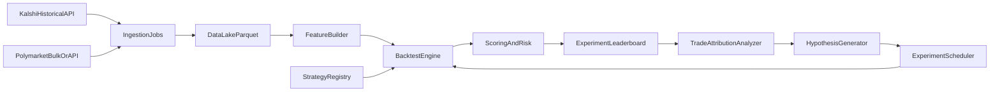

# Autonomous Prediction-Market Research Plan

## Goal

Build a Karpathy-style auto-research loop for binary contracts that can ingest historical data, run many backtest experiments across different strategy families (not only neural nets), rank results with robust metrics, and use winner/loser trade analysis to propose better next hypotheses.

## Scope and defaults

- Venue priority: **Kalshi first** for fastest reliable MVP, while keeping schema compatible with Polymarket.
- Objective: **Report both PnL and Sharpe** as primary leaderboard outputs.
- Strategy scope: start with **rule-based + statistical + ML** interfaces so the system can run any strategy type.

## Data availability decision (fastest path)

- **Kalshi official historical endpoints are available** (candlesticks, historical trades, historical cutoff):
  - [https://docs.kalshi.com/getting_started/historical_data](https://docs.kalshi.com/getting_started/historical_data)
  - [https://docs.kalshi.com/api-reference/historical/get-historical-trades](https://docs.kalshi.com/api-reference/historical/get-historical-trades)
  - [https://docs.kalshi.com/api-reference/historical/get-historical-market-candlesticks](https://docs.kalshi.com/api-reference/historical/get-historical-market-candlesticks)
- For quick expansion to Polymarket, prefer a bulk source with parquet/CSV snapshots first, then API streaming later.
- MVP ingestion mode: **batch downloader to parquet** with daily partitioning to avoid API-rate-limit bottlenecks during research runs.

## Target architecture

## Core components

- **Data layer**
  - Unified schema for binary contracts across venues: market metadata, quotes/trades, resolution, fees, timestamps.
  - Storage in partitioned parquet (venue/date/market).
  - Deterministic replay datasets (versioned snapshot IDs) so experiments are reproducible.
- **Backtest engine**
  - Event-driven simulator supporting:
    - market/trade event replay
    - order latency assumptions
    - slippage and fee model
    - position limits and bankroll constraints
  - Walk-forward evaluation and blocked time splits (to avoid leakage).
- **Strategy interface (any strategy type)**
  - Standard contract:
    - `fit(train_window)` optional
    - `predict(state)` -> probability/edge/confidence
    - `decide(prediction, risk_state)` -> orders
  - Implementations:
    - Rule-based (threshold, spread/liquidity filters, event-time heuristics)
    - Statistical (calibration, logistic models, Bayesian updates)
    - ML/NN (if useful later)
- **Experiment orchestrator**
  - Search over:
    - hyperparameters
    - feature sets
    - strategy families
    - risk/position sizing rules
  - Uses queue-based workers and tracks every run as immutable artifact.
- **Scoring and ranking**
  - Primary scoreboard fields:
    - net PnL
    - Sharpe
    - max drawdown
    - turnover
    - hit rate
    - calibration error / Brier score (if probabilistic outputs)
  - Composite rank example:
    - hard constraints: min trades, max drawdown
    - rank by weighted z-score over PnL + Sharpe + stability metrics
- **Trade attribution + feedback loop**
  - Per-trade tagging: market regime, time-to-expiry, spread/liquidity state, confidence bucket.
  - “What won / what lost” report per run:
    - top profitable contexts
    - top loss contexts
    - failure modes (late entry, poor liquidity, overconfident mispricing)
  - Feed these tags back into next experiment proposals:
    - prune failing regions
    - mutate feature/risk hypotheses near successful contexts

## Evaluation protocol (critical)

- Use **rolling walk-forward** windows, not random splits.
- Keep a final untouched holdout period for tournament ranking.
- Include transaction costs, stale quote handling, and realistic fill assumptions.
- Require robustness checks:
  - nearby-parameter stability
  - venue/time-slice consistency
  - sensitivity to latency/slippage perturbations

## Fast MVP implementation sequence

1. Ingest Kalshi historical trades + candlesticks into parquet.
2. Build minimal event replay backtester with fees/slippage and position sizing.
3. Add 3 baseline strategies (rule, logistic, simple market-making/edge threshold).
4. Implement experiment runner + artifact logging + leaderboard.
5. Add trade attribution report and automatic next-hypothesis generation.
6. Add Polymarket adapter reusing same schema/backtest interfaces.

## Suggested repository layout

- `[project]/data_ingest/` : venue adapters, download jobs, schema normalization
- `[project]/data_lake/` : parquet snapshots + manifests
- `[project]/backtest/` : simulator, execution model, cost model
- `[project]/strategies/` : strategy base interface and implementations
- `[project]/experiments/` : search spaces, schedulers, run definitions
- `[project]/scoring/` : metrics, ranking, robustness tests
- `[project]/analysis/` : trade attribution, diagnostics, report generation

## Key risks and mitigations

- API/rate-limit friction -> prefer batched historical pulls and cached parquet snapshots.
- Overfitting to one period -> enforce walk-forward + untouched holdout + perturbation tests.
- Unrealistic fills -> conservative execution assumptions and slippage stress tests.
- Strategy fragmentation -> single strategy interface and shared evaluator contract.

## Immediate next decisions after approval

- Choose first market universe slice (e.g., one liquid category).
- Define initial fee/slippage/latency assumptions.
- Set compute budget and experiment cadence (daily/weekly tournaments).

